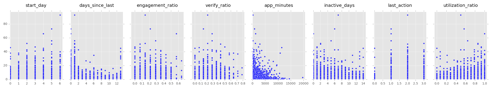
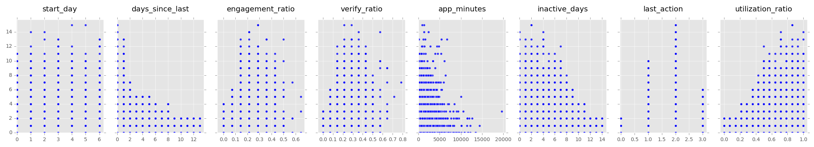
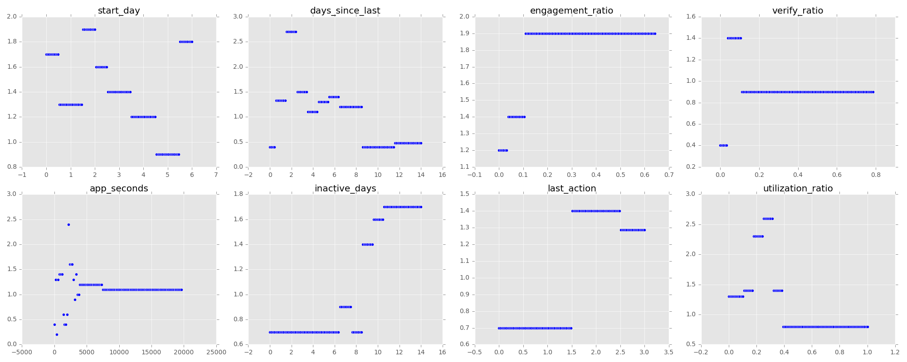

# Goals
- build predictive model
- explain the key indicators of future redemption behaviors

# Problems
- Class imbalance
    - only 17% of the data has future redemptions
- Data are in time series column-wise

# Key Metrics
- Since future redemptions are mostly negative, model accuracy will always be high for true negatives
- focus on:
    - increasing true positives
    - improving recall and f1-score

# Feature Engineering
Since the data was in time series column-wise, I decided to use feature engineering to extract important pieces of information from each row. The feature extraction functions that I created are as follows:
- fix_columns
    - Convert 'gap' to 0, 'engage' to 1, and verify to '2'. Keep session the same to extract app_minutes later
- days_since_last
    - calculates the number of days since last activity
- engagement_ratio
    - calculates the ratio of days that have engaged activity
- verify_ratio
    - calculates the ratio of days that have verify activity
- app_minutes
    - for the session data, uses regular expression to add the minutes spent on the app
- inactive_days
    - returns the count of inactive days in the last 14 days
- last_action
    - displays the last action of the user
- utilization_ratio
    - calculates the ratio of utilization of the app to the total days

The feature functions were packaged in feature_functions.py and mapped to the DataFrame via the following:


```
for func in functions:
    df[func.__name__] = df[day_columns].apply(lambda x: func(x), axis=1)
```

# EDA
scatter plot of future_redemptions to engineered feature
## 

## Outlier Removal
For the discrete engineered features, there appears to be outliers. Using pandas and (mean + 3 * standard deviation), I removed future_redemptions outliers categorically for each feature.
## 

# Predictive Modeling
4 different models were fit on the binary classification for future_redemptions.
- random forrest (rf)
- gradient boosted random forrest (gbr)
- adaptive boosted random forrest (adr)
- k-nearest neighbors (knn)

I used sklearn's gridsearchcv to tune the hyperparamaters for gbr and adr however, random forest out performed both boosted models and the knn implementation.

# Class Imbalance
Since only 17% of the data contained positive classification, I used numpy to sample with replacement (bootstrap) the positive classes and append to the data frame. The data was then split into training and testing groups to train the models.
```
df_redeemed = df[df['redeemed'] == True]
k = len(df) - len(df_redeemed)
up_sample = df_redeemed.iloc[np.random.randint(0, len(df_redeemed), size=k)]
df = df.append(up_sample, ignore_index=True)
```
## The following charts show classification scoring for true classification:
### Initial modeling
|model|precision|recall|f1-score|
|---|---|---|---|
|rf|0.56|0.41|0.47|
|gbr|0.63|0.41|0.51|
|adr|0.63|0.45|0.52|
|knn|0.53|0.38|0.44|

### Removed outliers
|model|precision|recall|f1-score|
|---|---|---|---|
|rf|0.55|0.45|0.50|
|gbr|0.64|0.50|0.56|
|adr|0.64|0.50|0.56|
|knn|0.56|0.45|0.50|

### Removed outliers and up-sampled imblanced class
|model|precision|recall|f1-score|
|---|---|---|---|
|rf|0.91|0.96|0.93|
|gbr|0.83|0.86|0.84|
|adr|0.83|0.84|0.84|
|knn|0.83|0.94|0.88|

# Feature importance
Using the random forrest model with removed outliers and up-sample of the imbalanced class, we can use the random forrest class' .feature\_importances_ to see how each feature was split during the fit of the trees.

- start_day - 10.85%
- days_since_last - 21.95%
- engagement_ratio - 4.55%
- verify_ratio - 15.27%
- app_minutes - 17.89%
- inactive_days - 19.69%
- last_action - 2.36%
- utilization_ratio - 7.44%

This shows us that for determining if a user will make a future redemption, the most important features to consider are the days since last action, minutes spent on the app, and number of inactive days in the last 2 weeks.

However, this does not allow us to predict how many future redemptions the user will have. We can instead run a simple Random Forrest Regressor model on the data that we have created.

## The resulting R squared score was 88.6%

I used the trained model and iterated over the range of possible variables for each feature holding the other columns fixed at their mean value. The result shows us changing each variable, impacts the value of future redemptions.
## 

following the previously stated feature importances, we see that if we wish to improve chances of future redemption, we should target:
- users who have days since last use are greater than 8
- app_seconds that are less than 1000
- inactive days that are lower than 10
